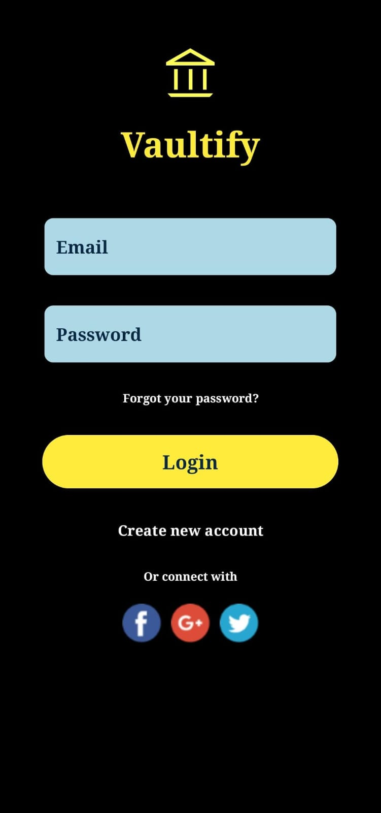

# BankingProject

This is a Java-based mobile banking application that allows users to sign up, log in, and perform various banking operations.

## Preview



## Features

- **User Registration**: Users can sign up with their email, username, and password.
- **User Authentication**: Firebase Authentication is used for user login and registration.
- **Database Integration**: Firebase Realtime Database is used to store user data.
- **Social Media Links**: Users can navigate to social media pages from the app.
- **Responsive UI**: The app has a user-friendly and responsive interface.
- **Send Money**: Users can send money to other users.
- **Transaction History**: Users can view their transaction history.
- **Account Balance**: Users can check their account balance.

## Technologies Used

- **Java**: Core programming language.
- **Firebase Authentication**: For user authentication.
- **Firebase Realtime Database**: For storing user data.
- **Android SDK**: For building the mobile application.
- **ConstraintLayout**: For designing the user interface.

## Installation

To run the project locally:

1. Clone the repository:
   ```bash
   git clone https://github.com/Saqibb786/BankingProject.git
   ```

## Contributing 🤝

We welcome contributions from everyone. If you'd like to contribute, please fork the repository and create a pull request.

1. **Fork the repository**
2. **Create a new branch**: `git checkout -b feature/your-feature-name`
3. **Commit your changes**: `git commit -m 'Add some feature'`
4. **Push to the branch**: `git push origin feature/your-feature-name`
5. **Open a pull request**

## License 📄

This project is licensed under the MIT License - see the [LICENSE](LICENSE) file for details.
